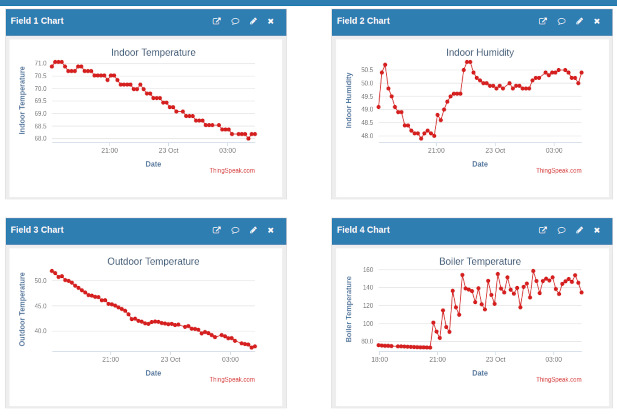
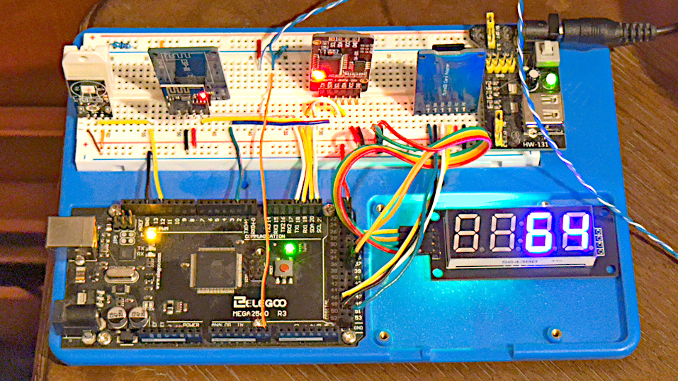
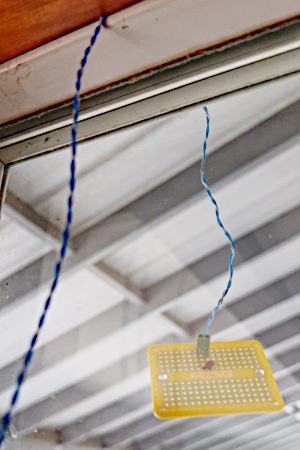

# home-made-home-monitor

Build a home monitor system with an Arduino

Connect some indoor and outdoor sensors to an Arduino, take measurements at regular intervals, send the data to an external server for logging and visualize it online.

A combination of inexpensive components plus a non-commercial account with Thingspeak examines how commercial home-monitoring systems might work. It could be of educational interest to anyone interested in looking behind the scenes into the so-called Internet of Things.

## Components
* [An Arduino Mega2560 or similar development board](#development-board)
* [DHT22 Humidity and Temperature Sensor](#dht22)
* [A Thermistor, resistor, and a pair of long wires](#thermistor)
* [ESP8266 controller having Expressif AT-type firmware installed](#esp8266)
* [SD card adapter](#sd-card-adapter)
* DS3231 Real Time Clock module
* TM1637 Display module
* Optional voltage regulator
* Solderless breadboard and hookup wire

Each one of the components is discussed in separate sections of this article. Links to the sections are provided above for convenience.

## Arduino Mega2560 Development Board
This project needed a Mega2560-style development board for two reasons.

The first reason is memory capacity. Arduino IDE compiles the example program to almost 37,000 bytes. This size is too large for an Uno-style board, which has only a 32K-byte flash (program) memory. The Mega2560 gives a roomy 256K of flash.

Moreover, the program and the device libraries that support it combine to require more than 2,500 bytes of random-access memory. An Uno has, at most, 2,048 bytes. The Mega2560 provides a comfortable 32,768 bytes.

The second reason is that it calls for two Serial input-output connections in the hardware. One connection is for communication with a Serial Monitor program running on an attached computer. The second goes to the ESP8266 for internet access.

I considered using the Arduino Software Serial library with an Uno-style board for the ESP8266 but decided to play it safe by sending all Serial I/O through hardware.

<a href="#components">Back to List of Components</a>

## Arduino Device Code Libraries
Most of the devices in this project are what I call &ldquo;semi-smart&rdquo; devices. It means they do part of the work internally, gathering, organizing and storing the information they can provide.

For these, an Arduino program will use custom-tailored code that it &ldquo;includes&rdquo; from a <em>library</em>. The following selection of code lines from the example program lists the device libraries it includes.

~~~ c
/* The following libraries come pre-installed with Arduino IDE */
#include <Wire.h>             // for I2C communication with the DS3231 RTC
#include <SPI.h>              // for SPI communication with SD card device
#include <SD.h>               // to read and write files on SD card device

/* These additional libraries need to be installed using the Library Manager */
#include <DHT.h>              // Adafruit library
#include <DHT_U.h>            // Adafruit dependency
#include <DS3231.h>           // DS3231 Real Time Clock (by Andrew Wickert)
#include <WiFiEsp.h>          // talk to the 8266 (by bportaluri)
#include <ThingSpeak.h>       // talk to ThingSpeak (by MathWorks)
#include <TM1637Display.h>    // LED display module (by Avishay Orpaz)
~~~

Some device libraries are provided by companies that manufacture or sell the devices. The Adafruit libaries supporting the DHT22 are example of seller-provided code.

Volunteers contribute libraries for most of the devices used in this project. The Arduino IDE includes a Library Manager that you can use to discover and install device libraries. 

The Manager shows the names of the people who contributed each library. I have identified such libraries in this project by including the contributors' names in parentheses.

<a href="#components">Back to List of Components</a>

<h2 id="dht22">DHT22 Humidity and Temperature Sensor</h2>
This one measures temperature and humidity inside the house. I had some old ones on the shelf and they seem to work, so I use one here. I discuss contemporary controversy about these devices below, after showing the code.

To fetch the indoor temperature and humidity from the DHT22 involves a delicate dance combining both data and timing signals along a single wire between the Arduino and the DHT22. It pays to check the results and to try again if need be.

The variables named "humidity" and "temperature" were declared earlier in the program. The following procedure assigns values to them from the sensor.

~~~ c
    humidity = dht.readHumidity();                  // percent relative humidity
    indoorTemperature = dht.readTemperature(true);  // true selects Fahrenheit
    /* Did either reading return NaN, meaning Not a Number?
     * If so, make up to ten more attempts before giving up.
     */
    if (isnan(humidity) || isnan(indoorTemperature)) {
      int DHTattempt = 0;
      while ( (DHTattempt < 10) &&
              (isnan(humidity) || isnan(indoorTemperature))
            ) 
        /* repeat the tests until either
         * both readings are valid numbers
         * or the count of attempts reaches 10 */
      {
        humidity = dht.readHumidity();                  // percent relative humidity
        indoorTemperature = dht.readTemperature(true);  // true selects Fahrenheit
        DHTattempt += 1;  
      }
    }
    /* if still failing, exit this attempt to log data */
    if (isnan(humidity) || isnan(indoorTemperature)) {
      Serial.println(F("Failed to read from DHT sensor!"));
      return;
    }

    /* Reaching this point means we have obtained
     * valid readings from the DHT22 sensor */
~~~

As we enter the second quarter of the 21st century we can choose alternative products. Adafruit recommends using a newer type of sensor instead of the DHT22. You can read their commentary [at this link](https://learn.adafruit.com/modern-replacements-for-dht11-dht22-sensors/overview).

Briefly, Adafruit points out that more reliable performance may be obtained from newer sensors that use two, separate wires for communication, one for timing signals and the other for data.

<a href="#components">Back to List of Components</a>

<h2 id="thermistor"> Measure Outdoor Temperature with a Thermistor</h2>

How simple it appears, dangling there outside a window under the patio roof! 

A termistor is a type of resistor having impedence that varies with temperature. The temperature can be evaluated by placing it in series with a second, fixed resistor, forming a voltage divider. The Arduino can interpret the voltage as a number. A bit of arithmetic transforms the number into a temperature.

Several years ago I wrote a rather extensive article here on GitHub about using thermistors this way. Here is a link to it: [Thermistor-Thermometer](https://github.com/IowaDave/Thermistors).

The project described here does not use a library for the thermistor, even though many such libraries exist. I had two reasons for this decision: a) the math is not particularly difficult; and b) customized code can try to calibrate a selected thermistor for improved accuracy.

I connected the voltage divider to analog pin A7 on the Arduino. The math is in a custom-written subroutine which returns a temperature in Fahrenheit as a floating-point value. 

The subroutine has two side effects also. It outputs diagnostic information to the Serial Monitor, and it presents the outside air temperature (rounded to the nearest whole number) on a TM1637 LED display. 

~~~ c
float getOAT ()
{
  const double calibrateTherm = 1.08;
  double therm = 0;
  double thermAvg = 0;
  char thermCount = 0;

  // smooth the measurement by accumulating an average of 15 readings 
  while (thermCount < 15)
  {
    // the fixed resistor R2 in the circuit measures 99.3 kOhm
    // estimate thermistor R1 resistance from divided voltage 
    therm = ((1023.0 / analogRead(A7))-1)*99300 * calibrateTherm;

    /* send diagnostic output to the Serial Monitor */

    // display the calculated thermistor resistance in Ohms
    Serial.print(therm);
    Serial.print(" => ");
    // convert thermistor resistance to temperature
    // see github.com/iowadave/thermistors
    // degrees Kelvin
    therm = 1 / ((1.0/263.15) - (log(57670/therm) / 3936 ));
    // degrees Celsius
    therm = therm - 273.15;
    // degrees Fahrenheit
    therm = (therm * 1.8) + 32;
    // display the calculated temperature in degerees Fahrenheit
    Serial.println(therm);

    // calculate cumulative moving average

    thermAvg = (therm + (thermAvg * thermCount));
    thermCount = thermCount + 1;
    thermAvg = thermAvg / thermCount;
    // repeat at 1-second intervals
    delay(1000);
    // until thermCount = 15
  }

  /* display the averaged OAT as integer on the TM1637 */
  int t = (int) round(thermAvg);
  display.showNumberDec(t, false);

  /* return the averaged temperature,
   * typecasting it to float, 
   * to match the definition of this function
   * for compatability with ThingSpeak */

  return (float) thermAvg;
}
~~~

This very economical apparatus reports temperatures that range within one to three degrees Fahrenheit of those given by more costly commercial devices and by the U.S. Weather Bureau. It is close enough for my purposes.

<a href="#components">Back to List of Components</a>

<h2 id="esp8266">ESP8266 Having AT Firmware Installed</h2>
My project is designed to upload data to a remote server through an internet connection. An ESP8266 device enables it to connect to the internet through my home WiFi network.

The least-expensive and least-capable (though still mighty capable!) ESP8266 device, ESP-01, handles the task very nicely. In year 2025, ESP-01 devices were still being offered by numerous vendors through various online selling sites [such as this one at Amazon](https://www.amazon.com/ESP8266-ESP-01S-Wireless-Transceiver-DC3-0-3-6V/dp/B08B3VZS4N?dib=eyJ2IjoiMSJ9.lDbwLdauCB1LyHSbkdJ0eZ-3DwSo56jTOl_WZgDWuZl4sTNx-UuHY75D7yYNzmVmoky7Zq6AFd0m-KscEMpNExH-bev1n9BOhiTZw4L9gLHz5oOty3sC_paRlwTTOAes4prz-LNWbOP98V81y9-vxMESIo2Re0iy6zowAUk5TMGTajHXtCemwx5WCvi5uAjWyx5_Ta2--yHhQ6CsNKeyUt5Q-_yyDYACRu32kztgW4M.4Yf-q8En_QEdY03YdTYOC2JYDlFp1_WkB_nnUMhvX_s&dib_tag=se&keywords=esp8266%2Besp-01&qid=1761429030&sr=8-15&th=1). 

Please note that I show the previous and the following product links solely for illustration purposes. I have no connection with nor do I get any benefits from the respective vendors. Also I must say that there are other ways to connect an Arduino to the internet. This just happens to be the way I did it for this project.

I found it most convenient to mount the ESP-01 on an interface module for connection to the Arduino. Here is [a link to an example of such modules](https://www.amazon.com/Geekstory-Wireless-Breakout-Compatible-Arduino%EF%BC%88Pack/dp/B09C8CV885?dib=eyJ2IjoiMSJ9.lDbwLdauCB1LyHSbkdJ0eZ-3DwSo56jTOl_WZgDWuZl4sTNx-UuHY75D7yYNzmVmoky7Zq6AFd0m-KscEMpNExH-bev1n9BOhiTZw4L9gLHz5oOty3sC_paRlwTTOAes4prz-LNWbOP98V81y9-vxMESIo2Re0iy6zowAUk5TMGTajHXtCemwx5WCvi5uAjWyx5_Ta2--yHhQ6CsNKeyUt5Q-_yyDYACRu32kztgW4M.4Yf-q8En_QEdY03YdTYOC2JYDlFp1_WkB_nnUMhvX_s&dib_tag=se&keywords=esp8266+esp-01&qid=1761429030&sr=8-11). These things solve certain wiring problems.

ESP-01 devices might come from the manufacturer with the so-called AT-firmware installed. Or they might not. I elected to purchase a dedicated programming device for burning the AT-firmware onto an ESP-01. Here is [a link to such a programmer](https://www.amazon.com/esp8266-esp-01/s?k=esp8266+esp-01).

Obtaining and installing a suitable AT-firmware for an ESP-01 is something I figured out how to do five years ago. I have forgotten exactly how I did it. This article will be edited to include those details when I get around to it. Meanwhile, tutorials abound online. Adventurous readers may choose to pursue this interesting challenge on their own.

The Arduino ThingSpeak and WiFiEsp libraries I chose for this project were designed to work with the AT-command firmware of an ESP8266. When all goes well, code provided in the libraries conducts all of the relevant communication through the Serial-1 hardware of the MEGA2560 Arduino. It saves me a lot of code-writing work.

Code interacts with the ESP8266 device in two, different places. First, the device must be initialized during the startup procedure. I had it verify access to the remote server at ThingSpeak as part of the procedure. 

~~~ c
  // get the ESP-01 and ThingSpeak going
  Serial.print("Searching for ESP8266..."); 
  // initialize ESP module
  WiFi.init(&Serial1);

  // check for the presence of the ESP8266 device
  if (WiFi.status() == WL_NO_SHIELD) {
    Serial.println("WiFi shield not present");
    // HALT EXECUTION IF THE ABOVE TEST FAILS?
    while (true);
  }
  // If we get this far, it means 8266 is available
  Serial.println("found it!");

  Serial.println("Initializing Thingspeak");
  ThingSpeak.begin(espClient);  // Initialize ThingSpeak
  Serial.println("ThingSpeak initialized!"); 
~~~

Later, at ten-minute intervals during the loop() process, the following code uses the ESP-01 to write data to ThingSpeak. The variables containing access information for the WiFi network and for ThingSpeak received their values from the user-created secrets.h library imported at the beginning of the program.

~~~ c
    // Send the data via WiFi to ThingSpeak

    // Connect or reconnect to WiFi
    if(WiFi.status() != WL_CONNECTED){
      Serial.print("Attempting to connect to SSID: ");
      Serial.println(SECRET_SSID);
      while(WiFi.status() != WL_CONNECTED){
        WiFi.begin(ssid, pass);  // Connect to WPA/WPA2 network. Change this line if using open or WEP network
        Serial.print(".");
        delay(5000);     
      } 
      Serial.println("\nConnected.");
    }

    // set the fields with the values
    ThingSpeak.setField(1, indoorTemperature);
    ThingSpeak.setField(2, humidity);
    ThingSpeak.setField(3, outsideAirTemperature);

    // write to the ThingSpeak channel
    int x = ThingSpeak.writeFields(myChannelNumber, myWriteAPIKey);
    // check result of upload; 200 indicates success
    if(x == 200){
      Serial.println("Channel update successful.");
    }
    else{
      // any value different from 200 indicates trouble
      // report this result to the Serial Monitor
      Serial.println("Problem updating channel. HTTP error code " + String(x));
    }
~~~

<a href="#components">Back to List of Components</a>

## SD Card Adapter
Logging data to a remote server through the internet is all very well. However, to be on the safe side, why not also log it onto local storage.

For this purpose I purchased a widely-available type of SD Card adapter, perhaps like [the one illustrated at this link](https://www.amazon.com/HiLetgo-Adater-Interface-Conversion-Arduino/dp/B07BJ2P6X6?crid=2I2HGPXWUZH2Y&dib=eyJ2IjoiMSJ9.aWM2MrxhONxxTLmTiowiALuT4M6qxuwWn68TOEpfxeiDqoViZD7lJM8UFSylaZSZy-oO_sbfXSkg0cACkPQza-juignY-kj5f6KvvAe5pb7d8g1vqUBzHSRY7cM6_kLibSGDxNoWZq-sP3s_j0rou2aZRWUMQjj00qUvtl9828lldh3hVsbsJk980usuo0MU8CnLpMnu5xBIxu_KIX7us26deCywdNoEJ15RX-unRIk.nqwMnnOQjncoH2SBowcPz2wH00Zt2M06BhaU-1eNBTg&dib_tag=se&keywords=arduino+sd+card+adapter&qid=1761436695&sprefix=arduino+sd+card+adapter%2Caps%2C132&sr=8-3). 

This device connects to the SPI communication hardware of the Arduino. The SPI.h and SD.h libraries enable an Arduino program to use a micro-SD card as a kind of hard drive.

As I write this in the fall of 2025, five years' worth of data have gone onto the same SD card, with plenty of capacity still available. Once every year opr two I halt the system, pull out the card and copy the data into my home network file server.

Using the SD card involves simply working with a few of the SD library routines, which in turn make calls into the SPI library.

First, the startup() procedure initializes the SD card and opens the file to receive data. I named this file "UPSTAIRS" to distinguish it from another data file accumulating on another, similar device in the basement.

~~~ c
  // start up the data card
  Serial.print("Initializing SD card...");

  if (!SD.begin(SD_CHIP_SELECT)) {
    // error message to Serial monitor if SD card cannot be initialized
    Serial.println("SD CARD initialization failed!");
  } else {
    // report successful SD card initialization
    sdCardInitialized = true;
    Serial.println("SD card initialized OK");
  }

  // write this session's data table header to the file
  if (sdCardInitialized) {
    // read the clock
    clockData = RTClib::now();
    // write the header
    dataFile = SD.open("mydata.txt", FILE_WRITE);
    dataFile.println("Home Temperatures and Humidity");
    dataFile.print("Data logging initiated at ");
    // the current date
    dataFile.print(clockData.month()); dataFile.print("/");
    dataFile.print(clockData.day()); dataFile.print("/");
    dataFile.print(clockData.year());
    dataFile.print("\t"); // tab

    // the current time
    dataFile.print(clockData.hour()); dataFile.print(":");
    if (clockData.minute() < 10) dataFile.print("0");
    dataFile.print(clockData.minute()); dataFile.print(":");
    if (clockData.second() < 10) dataFile.print("0");
    dataFile.println(clockData.second());

    // the field headers for data in tab-delimited columns
    // Date <tab> Time <tab> Indoor_T <tab> Indoor_H <tab> OAT
    dataFile.println("Date\tTime\tIndoor_T\tIndoor_H\tOAT");

    // close the file on the SD card
    dataFile.close();
  }
~~~

The loop() procedure appends the actual data into the SD card file.

~~~ c
    /* output time and temperature data to the SD card 
     * as tab-delimited columns */ 

    if (sdCardInitialized) {
      // open a 'datafile' object for writing to the file
      dataFile = SD.open("mydata.txt", FILE_WRITE);

    /* date and time obtained from the DS3231 in a previous step */

      // write the current date
      dataFile.print(clockData.month()); dataFile.print("/");
      dataFile.print(clockData.day()); dataFile.print("/");
      dataFile.print(clockData.year());
      dataFile.print("\t"); // tab

      // write the current time
      dataFile.print(clockData.hour()); dataFile.print(":");
      if (clockData.minute() < 10) dataFile.print("0");
      dataFile.print(clockData.minute()); dataFile.print(":");
      if (clockData.second() < 10) dataFile.print("0");
      dataFile.print(clockData.second());
      dataFile.print("\t"); // tab

      // write the data
      dataFile.print(indoorTemperature);  
      dataFile.print("\t"); // tab
      dataFile.print(humidity);
      dataFile.print("\t"); // tab
      dataFile.print(outsideAirTemperature);

      // the line end
      dataFile.println();

      // close the file
      dataFile.close();
    }  // SD card
~~~

Some of these SD card adapters may have a wiring layout onboard which causes them to monopolize the SPI hardware. I gave up trying to fix that problem because time is finite and has other uses, and the SD card reader is really the only SPI device my project needs.

<a href="#components">Back to List of Components</a>

## There Is More To Say

Not finished yet! I pause here in late October 2025. Tell the customers I have gone fishing.

<a href="#components">Back to List of Components</a>

